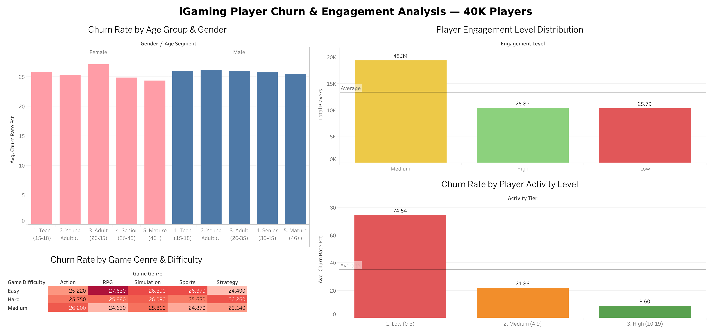

# iGaming Product Analytics Portfolio
A collection of product analysis projects focused on the iGaming industry, built to demonstrate product analytics skills using real-world datasets.

## ⭐️ About
This portfolio showcases product analytics work including player behaviour analysis, retention metrics, bonus efficiency, and revenue performance — targeting Product Analyst roles in iGaming.

## ⭐️ Stack
- **SQL** (SQLite) — data extraction and transformation
- **Tableau Public** — interactive dashboards
- **GitHub** — version control and portfolio hosting

---

## ⭐️ Cases

### [Case 01 — Coming Soon]()
> *In progress*

---

### [Case 02 — Player Churn & Engagement Analysis](case-02-player-churn-engagement/README.md)
Analysis of 40,000+ player records to identify key churn drivers and behavioral engagement patterns.
> Tools: SQL · Tableau Public
> Dataset: 40,034 players | 13 variables | Online Gaming Behavior

🔗 [View Dashboard](https://public.tableau.com/views/iGamingPlayerChurnEngagementAnalysis40KPlayers/Dashboard1)

---

## ⭐️ Dashboards Preview

| Case | Dashboard |
|---|---|
| Player Churn & Engagement |  |
