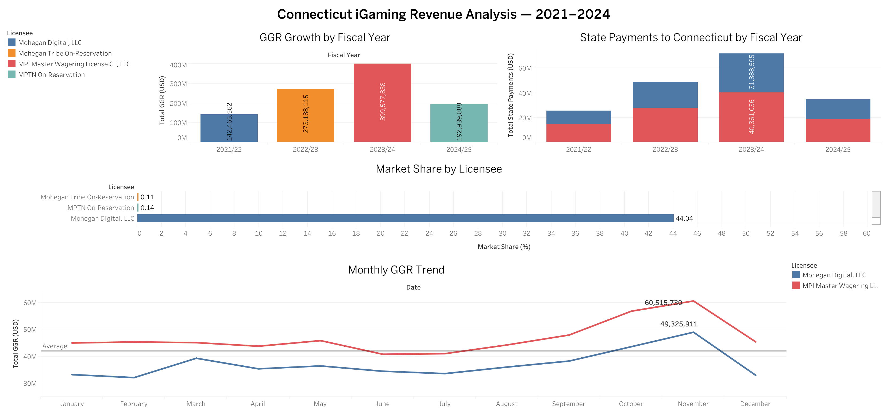
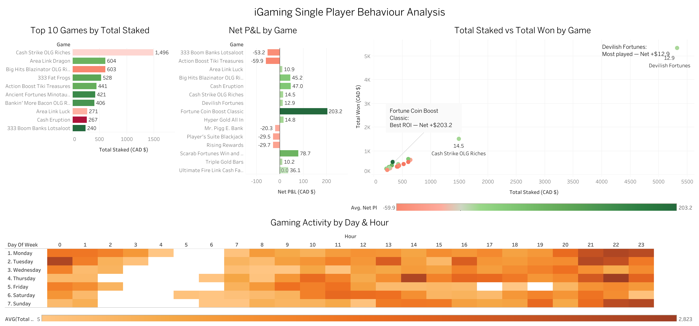
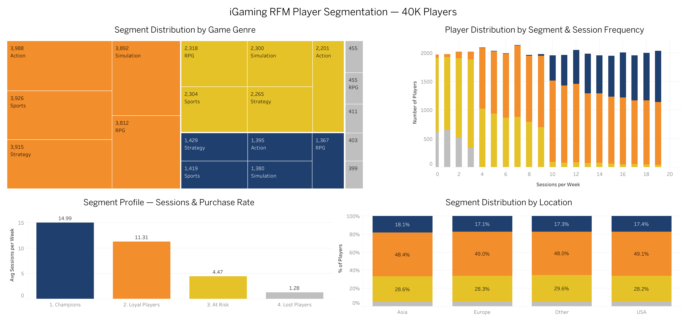
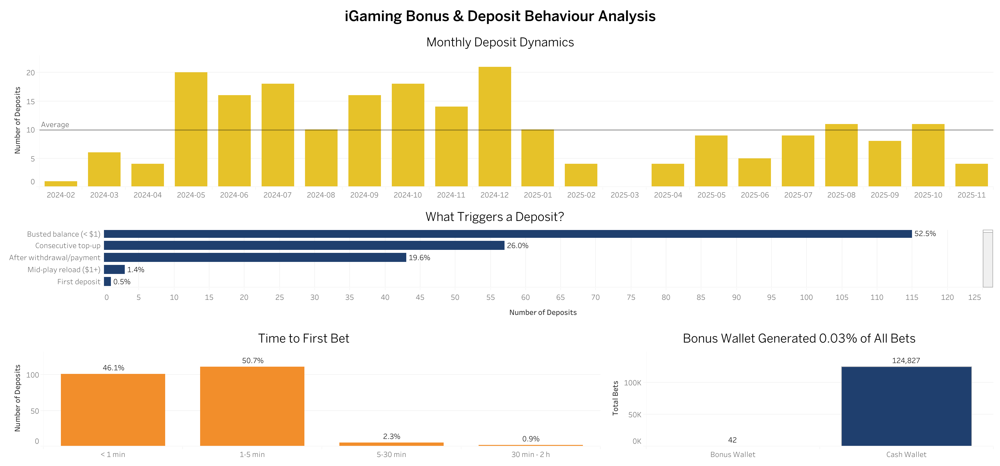

# iGaming Product Analytics Portfolio
A collection of product analysis projects focused on the iGaming industry, built to demonstrate product analytics skills using real-world datasets.

## ⭐️ About
This portfolio showcases product analytics work including player behaviour analysis, retention metrics, revenue performance, and market analysis — targeting Product Analyst roles in iGaming.

## ⭐️ Stack
- **SQL** (SQLite) — data extraction and transformation
- **Tableau Public** — interactive dashboards
- **GitHub** — version control and portfolio hosting

---

## ⭐️ Cases

### [Case 01 — Connecticut iGaming Revenue Analysis 2021–2024](case-01-connecticut-igaming-revenue/README.md)
Analysis of Connecticut's regulated online casino gaming market from launch to maturity using official state regulatory data.
> Tools: SQL · Tableau Public
> Dataset: 142 monthly records | 4 licensees | October 2021 – November 2024

🔗 [View Dashboard](https://public.tableau.com/views/ConnecticutiGamingRevenueAnalysis20212024/Dashboard1)

---

### [Case 02 — Player Churn & Engagement Analysis](case-02-player-churn-engagement/README.md)
Analysis of 40,000+ player records to identify key churn drivers and behavioral engagement patterns.
> Tools: SQL · Tableau Public
> Dataset: 40,034 players | 13 variables | Online Gaming Behavior

🔗 [View Dashboard](https://public.tableau.com/views/iGamingPlayerChurnEngagementAnalysis40KPlayers/Dashboard1)

---

### [Case 03 — Single Player Behaviour Analysis](case-03-single-player-behaviour/README.md)
Deep-dive analysis of a single player's complete transaction history — 156,672 transactions across 21 months covering game preferences, session patterns, and financial performance.
> Tools: SQL · Tableau Public
> Dataset: 156,672 transactions | 1 player | February 2024 – November 2025 | CAD

🔗 [View Dashboard](https://public.tableau.com/views/iGamingSinglePlayerBehaviourAnalysis/Dashboard1)

---

### [Case 04 — RFM Player Segmentation](case-04-rfm-player-segmentation/README.md)
RFM segmentation of 40,034 players into four value segments — Champions, Loyal Players, At Risk, Lost — identifying behavioural drivers of player value, retention risks, and win-back opportunities.
> Tools: SQL · Tableau Public
> Dataset: 40,034 players | 13 variables | 4 RFM segments

🔗 [View Dashboard](https://public.tableau.com/views/iGamingRFMPlayerSegmentation40KPlayers/Dashboard1)

---

### [Case 05 — Bonus & Deposit Behaviour Analysis](case-05-bonus-deposit-behaviour/README.md)
Deposit trigger analysis across a 21-month player history — the welcome bonus generated 0.03% of betting activity, while 52.5% of deposits happen at a busted balance. Deposits are play-continuation events, not bonus responses.
> Tools: SQL · Tableau Public
> Dataset: 156,672 transactions | 219 deposits | February 2024 – November 2025 | CAD

🔗 [View Dashboard](https://public.tableau.com/views/iGamingBonusDepositBehaviourAnalysis/Dashboard1)

---

## ⭐️ Dashboards Preview

| Case | Dashboard |
|---|---|
| Connecticut iGaming Revenue |  |
| Player Churn & Engagement |  |
| Single Player Behaviour |  |
| RFM Player Segmentation |  |
| Bonus & Deposit Behaviour |  |
